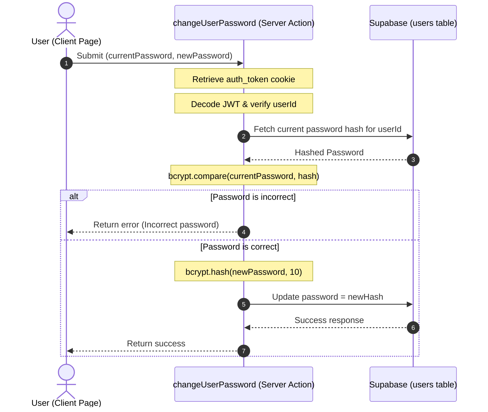

# Design Document: Profile Change Password Verification and Update

## Overview
Implement a verification mechanism for changing user password on the Profile page. The system will verify if the user's current password is correct (matching the hashed bcrypt password in the custom `users` database table) before updating the password to the new hashed password.

---

## 1. Architecture & Flow



---

## 2. Implementation Specifications

### 2.1 Backend Server Action (`lib/actions/auth.ts`)
- Add a new server function:
  ```typescript
  export async function changeUserPassword(currentPassword: string, newPassword: string)
  ```
- **Process Details:**
  1. Retrieve cookie `auth_token` or `token`.
  2. Parse JWT to verify authorization and fetch `userId`. Return `{ success: false, error: "Not authenticated" }` if invalid.
  3. Query `users` table:
     ```typescript
     const { data: user, error } = await supabase
       .from("users")
       .select("password")
       .eq("id", userId)
       .single();
     ```
  4. Compare `currentPassword` with `user.password` using `bcrypt.compare`.
  5. Hash `newPassword` if comparison succeeds:
     ```typescript
     const salt = await bcrypt.genSalt(10);
     const newPasswordHash = await bcrypt.hash(newPassword, salt);
     ```
  6. Update database row:
     ```typescript
     const { error: updateError } = await supabase
       .from("users")
       .update({ password: newPasswordHash })
       .eq("id", userId);
     ```

### 2.2 Frontend Profile Page (`app/dashboard/profile/page.tsx`)
- Import `changeUserPassword` from `@/lib/actions/auth`.
- Update `handleUpdatePassword` implementation:
  - Add basic validation checks (fields completed, length >= 6, match confirmations) which are already present.
  - Call `await changeUserPassword(passwords.currentPassword, passwords.newPassword)`.
  - Handle results:
    - On success: set `passwordMsg` type to "success" and clear the fields.
    - On failure: set `passwordMsg` type to "error" with the returned error message.

---

## 3. Testing & Verification Plan
- **Verification steps:**
  1. Go to the profile page.
  2. Test submitting empty fields -> Verify error message.
  3. Test submitting new passwords that do not match -> Verify error message.
  4. Test submitting a password shorter than 6 characters -> Verify error message.
  5. Test submitting an incorrect current password -> Verify it returns "รหัสผ่านปัจจุบันไม่ถูกต้อง" (Incorrect current password).
  6. Test submitting a correct current password and a valid new password -> Verify it updates successfully and clears inputs.
  7. Verify logging in again works using the new password.
